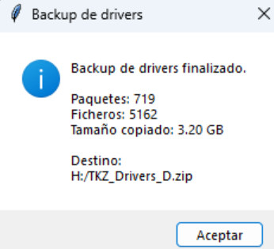
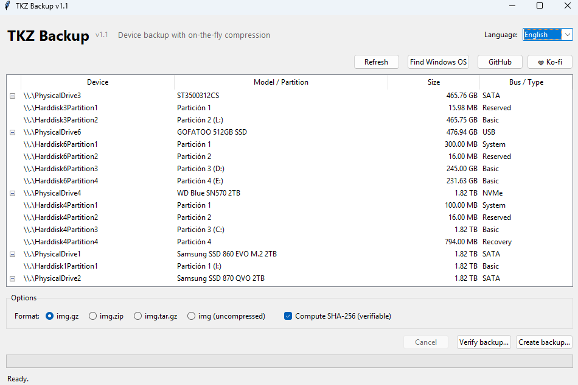

# TKZ Backup

[Español](#-español) · [English](#-english)

---

## 🇪🇸 Español

Herramienta de **backup de discos y particiones** con compresión *on-the-fly* (sin archivo intermedio), interfaz gráfica sencilla, verificación de integridad por SHA-256 y **rescate de drivers** de instalaciones Windows (incluidos drivers OEM de fabricantes que ya no existen).

Pensada principalmente para crear imágenes de **dispositivos USB** desde Windows, pero el código es multiplataforma (Windows / Linux / macOS).


### Capturas de pantalla

<details>
<summary>Ver capturas</summary>

#### Instalaciones de Windows detectadas y backup de drivers


#### Backup de drivers finalizado



#### Interfaz principal en inglés



</details>

### Características

- GUI nativa (Tkinter / ttk) con i18n **Español / Inglés** y cambio de idioma en caliente.
- Detección automática de discos físicos y sus particiones.
- Compresión en streaming: el dispositivo se lee y se comprime al mismo tiempo, sin ocupar espacio extra para una imagen intermedia.
- Formatos soportados: `img.gz`, `img.zip`, `img.tar.gz` o `img` (sin comprimir).
- Lectura raw de 16 MB con `FILE_FLAG_NO_BUFFERING` + arquitectura productor/consumidor en hilos (lectura de disco y compresión en paralelo).
- Cálculo de **SHA-256** durante el backup y sidecar `.sha256` para verificar después.
- Botón **Verificar backup** que descomprime en streaming y compara hashes.
- **Buscar OS Windows** detecta instalaciones Windows (7 / 10 / 11) en las particiones con letra asignada y permite hacer **Backup Drivers** de cada una.
- En Windows se solicita elevación UAC automáticamente (manifiesto `requireAdministrator`).

### ¿Qué incluye un "Backup Drivers"?

Pensado para rescatar drivers cuando el fabricante ya no da soporte o ha desaparecido:

| Origen en la partición Windows | Carpeta en el backup | Para qué sirve |
| --- | --- | --- |
| `Windows\System32\DriverStore\FileRepository\` | `FileRepository/` | Paquetes completos de drivers instalados por Plug and Play. Es la fuente canónica y permite reinstalar con `pnputil`. |
| `Windows\INF\oem*.inf` + `oem*.PNF` | `INF/` | Índice de drivers OEM (mapea cada paquete con el dispositivo que lo usa). |
| `Windows\System32\drivers\*.sys` / `*.dll` | `System32_drivers/` | Binarios kernel cargados. Imprescindible para drivers legacy de Windows 7. |
| `Windows\System32\CatRoot\` | `CatRoot/` | Catálogos de firma digital (`.cat`) — necesarios para validar firmas al reinstalar. |
| `C:\Drivers`, `C:\SWSetup`, `C:\Dell\Drivers`, `C:\SWTOOLS`, `C:\OEM`, `C:\Intel`, `C:\AMD`, `C:\NVIDIA`, `C:\MSI`, `C:\ASUS`, `C:\Lenovo`, `C:\HP` | `OEM_Installers/<carpeta>/` | Instaladores originales del fabricante (chipset, control de ventiladores, hotkeys, lector de huella…). |
| `C:\ProgramData\{Dell,HP,Lenovo,ASUS,MSI}` | `OEM_Installers/ProgramData_<marca>/` | Cachés de drivers usadas por las suites del fabricante (Dell SupportAssist, etc). |
| Manifiesto generado a partir del parseo de cada `.inf` | `manifest.json` | Listado completo: Provider, Class, DriverVer, CatalogFile, paquete. |

Cada backup incluye también un `LEEME.txt` / `README.txt` con instrucciones de reinstalación con `pnputil /add-driver ... /subdirs /install`.

> Solo se pueden analizar particiones con **letra de unidad asignada** y sistema de ficheros legible. Si la partición está sin letra, asígnale una desde el Administrador de discos antes de buscar.

### Uso

1. Descarga `TKZ Backup.exe` desde la sección [Releases](https://github.com/trankten/tkz_backup/releases) (Windows).
2. Doble clic → acepta el UAC.
3. Para imagen de disco/partición: selecciona el dispositivo, elige formato (recomendado `img.gz`) y **Crear backup…**. Conserva el `.sha256` que se genera para verificar después.
4. Para drivers: **Buscar OS Windows** → en cada partición Windows detectada pulsa **Backup Drivers** → elige Carpeta o ZIP.

### Compilar desde código

Requiere Python 3.10+.

```powershell
python -m venv .venv
.\.venv\Scripts\Activate.ps1
pip install pyinstaller
pyinstaller --noconfirm --clean --onefile --windowed --uac-admin --name "TKZ Backup" tkz_backup.py
```

En Linux/macOS basta con `sudo python tkz_backup.py` (o compilar con PyInstaller en esa plataforma).

### Apoyo

Si te resulta útil, puedes invitarme a un café en [Ko-fi](https://ko-fi.com/trankten) ❤

### Licencia

MIT

---

## 🇬🇧 English

[Español](#-español) · [English](#-english)

A **disk and partition backup** tool with *on-the-fly* compression (no intermediate file), a simple GUI, SHA-256 integrity verification, and **driver rescue** from Windows installations (including OEM drivers from vendors that no longer exist).

Mainly intended for creating **USB device** images on Windows, but the code is cross-platform (Windows / Linux / macOS).

### Features

- Native GUI (Tkinter / ttk) with **Spanish / English** i18n and on-the-fly language switching.
- Automatic detection of physical disks and their partitions.
- Streaming compression: the device is read and compressed simultaneously, with no extra space for an intermediate image.
- Supported formats: `img.gz`, `img.zip`, `img.tar.gz` or `img` (uncompressed).
- 16 MB raw reads with `FILE_FLAG_NO_BUFFERING` + producer/consumer threading (disk read and compression in parallel).
- **SHA-256** computed during the backup and stored in a `.sha256` sidecar for later verification.
- **Verify backup** button that streams-decompresses and compares hashes.
- **Find Windows OS** detects Windows (7 / 10 / 11) installations on partitions with an assigned letter and lets you **Backup Drivers** for each of them.
- On Windows, UAC elevation is requested automatically (manifest `requireAdministrator`).

### What is included in a "Backup Drivers"?

Designed to rescue drivers when the vendor no longer provides support or has disappeared:

| Source on the Windows partition | Folder in the backup | Purpose |
| --- | --- | --- |
| `Windows\System32\DriverStore\FileRepository\` | `FileRepository/` | Full driver packages installed by Plug and Play. Canonical source; allows reinstall with `pnputil`. |
| `Windows\INF\oem*.inf` + `oem*.PNF` | `INF/` | OEM driver index (maps each package to the device that uses it). |
| `Windows\System32\drivers\*.sys` / `*.dll` | `System32_drivers/` | Loaded kernel binaries. Essential for legacy Windows 7 drivers. |
| `Windows\System32\CatRoot\` | `CatRoot/` | Digital signature catalogs (`.cat`) — needed to verify signatures on reinstall. |
| `C:\Drivers`, `C:\SWSetup`, `C:\Dell\Drivers`, `C:\SWTOOLS`, `C:\OEM`, `C:\Intel`, `C:\AMD`, `C:\NVIDIA`, `C:\MSI`, `C:\ASUS`, `C:\Lenovo`, `C:\HP` | `OEM_Installers/<folder>/` | Original vendor installers (chipset, fan control, hotkeys, fingerprint reader…). |
| `C:\ProgramData\{Dell,HP,Lenovo,ASUS,MSI}` | `OEM_Installers/ProgramData_<vendor>/` | Driver caches used by vendor suites (Dell SupportAssist, etc). |
| Manifest built from parsing every `.inf` | `manifest.json` | Full list: Provider, Class, DriverVer, CatalogFile, package. |

Each backup also includes a `LEEME.txt` / `README.txt` with reinstall instructions using `pnputil /add-driver ... /subdirs /install`.

> Only partitions with an **assigned drive letter** and a readable file system can be inspected. If the partition has no letter, assign one in Disk Management before scanning.

### Usage

1. Download `TKZ Backup.exe` from the [Releases](https://github.com/trankten/tkz_backup/releases) page (Windows).
2. Double click → accept the UAC prompt.
3. For a disk/partition image: select the device, choose a format (recommended `img.gz`) and **Create backup…**. Keep the generated `.sha256` to verify later.
4. For drivers: **Find Windows OS** → on each detected Windows partition click **Backup Drivers** → choose Folder or ZIP.

### Build from source

Requires Python 3.10+.

```powershell
python -m venv .venv
.\.venv\Scripts\Activate.ps1
pip install pyinstaller
pyinstaller --noconfirm --clean --onefile --windowed --uac-admin --name "TKZ Backup" tkz_backup.py
```

On Linux/macOS just run `sudo python tkz_backup.py` (or build with PyInstaller on that platform).

### Support

If you find this useful, you can buy me a coffee on [Ko-fi](https://ko-fi.com/trankten) ❤

### License

MIT
